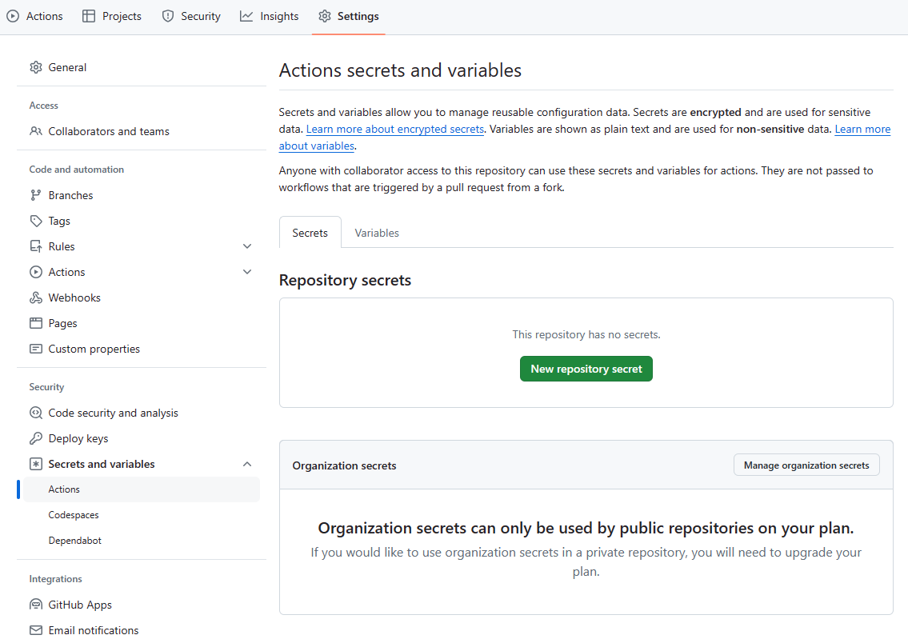

## Github Actions

Github Actions merupakan layanan CI/CD yang disediakan oleh Github. Github Actions memungkinkan kita untuk membuat workflow yang dapat dijalankan ketika terjadi perubahan pada repository. Dokumentasi dari Github Actions dapat diakses [di sini](https://docs.github.com/en/actions/).

Github Actions terdiri dari beberapa komponen sebagai berikut.

1. Workflows
   Workflow adalah kumpulan dari beberapa job yang dijalankan secara bersamaan atau berurutan. Workflow disimpan dalam file YAML pada direktori `.github/workflows/` di repository.

2. Events
   Events adalah trigger yang menyebabkan workflow dijalankan. Beberapa contoh events adalah push, pull request, dan issue.

3. Jobs
   Jobs adalah kumpulan dari beberapa step yang dijalankan secara bersamaan pada runner yang sama. Jobs dapat dijalankan secara bersamaan atau berurutan.

4. Actions
   Actions adalah perintah yang dijalankan pada runner. Actions dapat berupa perintah bash, perintah npm, atau action yang telah dibuat oleh pengguna. Actions dapat dibuat sendiri atau menggunakan action yang telah dibuat oleh pengguna lain.

5. Runners
   Runners adalah mesin yang menjalankan workflow. Runner dapat berupa runner yang disediakan oleh Github atau runner yang dihosting sendiri.

> Bagaimana cara membuat workflow pada Github Actions?

Berikut contoh cara membuat workflow pada Github Actions.

1. Buat file `check-version.yml` pada direktori `.github/workflows/` di repository.

2. Isi file dengan kode berikut.

   ```yaml
   name: check-version
   run-name: ${{ github.actor }} is learning GitHub Actions
   on: [push]
   jobs:
   check-bats-version:
     runs-on: ubuntu-latest
     steps:
       - uses: actions/checkout@v4
       - uses: actions/setup-node@v4
         with:
           node-version: "20"
       - run: npm install -g bats
       - run: bats -v
   ```

3. Push file ke repository.

4. Buka tab Actions pada repository.

### Expressions

Expression adalah cara untuk mengakses konteks pada workflow. Untuk menggunakan expression diperlukan sintaks berikut `${{ <expression> }}`. Berikut adalah beberapa contoh expression yang sering digunakan.

1. Literals
   - `${{ null }}`
   - `${{ true }}`
   - `${{ 2.78 }}`
2. Operators
   - `${{ 1 + 1 }}`
   - `${{ 2 > 1 }}`
   - `${{ 2 == 2 }}`
3. Context
   - `${{ github.actor }}`
   - `${{ github.repository }}`
   - `${{ github.event_name }}`
4. Functions
   - `${{ format('Hello, {0}', github.actor) }}`
   - `${{ toJson(github) }}`
   - `${{ steps.<step_id>.outputs.<output_name> }}`

Untuk detail lebih lengkap mengenai expressions dapat dilihat [di sini](https://docs.github.com/en/actions/learn-github-actions/expressions).

### Contexts

Context adalah informasi yang dapat diakses pada workflow. Context dapat berupa informasi tentang repository, event, atau runner. Context dapat diakses menggunakan expression. Detail context yang dapat digunakan dalam Github Action dapat dilihat [di sini](https://docs.github.com/en/actions/learn-github-actions/contexts).

### Variables

Variabel adalah cara untuk menyimpan nilai yang dapat digunakan pada workflow. Variabel dapat ditambahkan langsung pada file workflow atau dari Github Secrets. Berikut adalah contoh deklarasi variabel pada workflow.

```yaml
name: Variabel

on: [push]

env:
  DAY_OF_WEEK: Monday

jobs:
  greeting_job:
    runs-on: ubuntu-latest
    env:
      Greeting: Hello
    steps:
      - name: "Say Hello Mona it's Monday"
        if: ${{ env.DAY_OF_WEEK == 'Monday' }}
        run: echo "$Greeting $First_Name. Today is $DAY_OF_WEEK!"
        env:
          First_Name: Mona
```

Variabel hanya dapat diakses dalam scope yang sama. Sebagai contoh, variabel `Greeting` hanya dapat diakses pada job `greeting_job` dan variabel `First_Name` hanya dapat diakses pada step `Say Hello Mona it's Monday`.

Untuk menambahkan secrets atau variabel dalam repository, dapat dilakukan dengan cara berikut.



Secrets atau variables yang ditambahkan dapat diakses seperti pada contoh berikut.

```yaml
name: Variable

on: [push]

env:
  DAY_OF_WEEK: ${{ secrets.DAY_OF_WEEK }}

jobs:
  greeting_job:
    runs-on: ubuntu-latest
    env:
      Greeting: Hello
    steps:
      - name: "Say Hello Mona it's Monday"
        if: ${{ env.DAY_OF_WEEK == 'Monday' }}
        run: echo "$Greeting $First_Name. Today is $DAY_OF_WEEK!"
        env:
          First_Name: Mona
```

Untuk detail lebih lengkap mengenai variabel pada Github Actions dapat dilihat [di sini](https://docs.github.com/en/actions/learn-github-actions/variables).

### Cache Dependencies

Cache dependencies adalah cara untuk menyimpan dependencies yang telah diinstall pada runner. Cache dependencies dapat digunakan untuk mengurangi waktu yang dibutuhkan untuk menjalankan workflow. Beberapa dependencies yang tertera pada list berikut dapat langsung dikonfigurasi dengan menggunakan `setup-*` action.

| Package Managers    | Cache Dependency Action |
| ------------------- | ----------------------- |
| npm, yarn, pnpm     | setup-node              |
| pip, pipenv, poetry | setup-python            |
| gradle, maven       | setup-java              |
| RubyGems            | setup-ruby              |
| go.sum              | setup-go                |
| .NET NuGet          | setup-dotnet            |

Cache juga dapat dilakukan secara manual menggunakan action `cache`. Berikut adalah contoh penggunaan cache dependencies.

```yaml
name: Caching with npm
on: push
jobs:
  build:
    runs-on: ubuntu-latest
    steps:
      - uses: actions/checkout@v4

      - name: Cache node modules
        id: cache-npm
        uses: actions/cache@v3
        env:
          cache-name: cache-node-modules
        with:
          # npm cache files are stored in `~/.npm` on Linux/macOS
          path: ~/.npm
          key: ${{ runner.os }}-build-${{ env.cache-name }}-${{ hashFiles('**/package-lock.json') }}
          restore-keys: |
            ${{ runner.os }}-build-${{ env.cache-name }}-
            ${{ runner.os }}-build-
            ${{ runner.os }}-

      - if: ${{ steps.cache-npm.outputs.cache-hit != 'true' }}
        name: List the state of node modules
        continue-on-error: true
        run: npm list

      - name: Install dependencies
        run: npm install

      - name: Build
        run: npm run build

      - name: Test
        run: npm test
```

Penjelasan lebih lengkap mengenai cache dependencies dapat dilihat [di sini](https://docs.github.com/en/actions/using-workflows/caching-dependencies-to-speed-up-workflows).

### Workflow Artifacts

File yang dihasilkan dari workflow disebut sebagai artifacts. Mirip dengan cache, artifact juga dapat diakses melalui beberapa jobs. Perbedaan penggunaan cache dan artifact adalah sebagai berikut.

- Cache digunakan untuk menggunakan file yang tidak terlalu sering berubah antara jobs atau workflow runs yang berbeda, seperti hasil dependencies build dari package management system.

- Artifact digunakan untuk menyimpan file yang dihasilkan dari job yang akan digunakan pada job selanjutnya atau untuk diunduh oleh pengguna, seperti hasil build dari aplikasi atau log dari proses build.

Berikut adalah contoh penggunaan artifact pada workflow.

```yaml
name: Node CI

on: [push]

jobs:
  build_and_test:
    runs-on: ubuntu-latest
    steps:
      - name: Checkout repository
        uses: actions/checkout@v4
      - name: npm install, build, and test
        run: |
          npm install
          npm run build --if-present
      - name: Archive production artifacts
        uses: actions/upload-artifact@v4
        with:
          name: dist-without-markdown
          path: |
            dist
            !dist/**/*.md
```

Penjelasan lebih lengkap mengenai workflow artifacts dapat dilihat [di sini](https://docs.github.com/en/actions/using-workflows/storing-workflow-data-as-artifacts).
