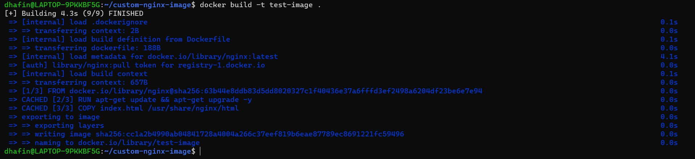
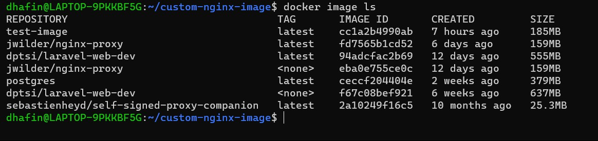
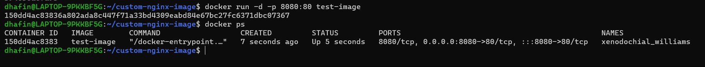

## Dockerfile and Registry

#### Pengertian Dockerfile

Dockerfile adalah file teks yang berisi instruksi untuk membangun sebuah Docker Image. Dalam Dockerfile, dapat menentukan berbagai komponen dan konfigurasi yang diperlukan untuk membuat sebuah image, seperti base image yang digunakan, perintah-perintah yang harus dijalankan, file yang harus di-copy, serta variabel lingkungan yang perlu di-set.

Dockerfile sangat penting dalam membangun sebuah image karena memungkinkan pengguna untuk membuat image dengan cara yang konsisten dan terdokumentasi dengan baik. Dengan Dockerfile, seorang developer dapat mereplikasi pengaturan dan konfigurasi yang sama setiap kali membangun sebuah image, bahkan pada lingkungan yang berbeda-beda.

Dengan menggunakan Dockerfile, developer tersebut dapat menentukan semua dependensi dan konfigurasi yang diperlukan dalam satu file yang dapat di-replikasi pada semua mesin atau lingkungan. Hal ini memudahkan pengembangan dan deployment aplikasi, karena tidak perlu melakukan instalasi manual pada setiap mesin atau lingkungan yang berbeda. `Inti pentingnya adalah konversi sebah aplikasi menjadi sebuah docker image yang lebih portable`.

#### Perintah Dockerfile

Berikut adalah beberapa perintah penting beserta penjelasannya yang bisa diimplementasikan pada Dockerfile.

| Perintah | Deskripsi |
| ------------ | ------------ |
| `FROM` | Menentukan base image yang akan digunakan untuk build. |
| `COPY` | Menyalin file atau folder dari host ke dalam image. |
| `ADD` | Menyalin file atau folder dari host ke dalam image, bisa juga digunakan untuk men-download file dari URL dan mengekstraknya ke dalam image. |
| `RUN` | Menjalankan perintah pada layer yang sedang dibangun dan membuat image baru. |
| `CMD` | Menentukan perintah default yang akan dijalankan saat container di-start. |
| `ENTRYPOINT` | Menentukan perintah yang akan dijalankan saat container di-start, dapat juga di-overwrite oleh perintah saat container di-run. |
| `ENV` | Menentukan environment variable di dalam container. |
| `EXPOSE` | Menentukan port yang akan di-expose dari container ke host. |
| `VOLUME` | Menentukan direktori yang akan di-mount sebagai volume di dalam container. |

#### Contoh Implementasi Dockerfile

1. Buat direktori baru , dalam direktori tersebut buat Dockerfile dan **`index.html`** sesuaikan dengan [ini](./custom-nginx-image/). 

2. Dalam direktori yang sudah tersebut, jalankan command **`docker build -t <nama image>`** untuk membuat image baru dari Dockerfile yang sudah ada. Isi nama image sesuai dengan yang diinginkan.

3. Lalu cek pada **`docker image ls`** , apakah image yang dibuild sudah tersedia.

4. Selanjutnya image yang sudah ada dapat digunakan, dengan command **`docker run -d -p 8080:80 <nama image>`** untuk menjalankan sebuah container dari image tersebut. Cek dengan **`docker ps`** apakah container sudah berjalan.

5. Kunjungi hasil running container pada **`localhost:8080`** maka akan muncul tampilan website 'Welcome to Nginx'.

#### Registry

Registry dalam konsep CI/CD pipeline adalah tempat penyimpanan untuk berkas-berkas yang dibuat selama proses pembangunan dan pengiriman perangkat lunak. Ini biasanya digunakan untuk menyimpan gambar Docker atau paket lainnya yang diperlukan untuk menjalankan aplikasi.

Dalam siklus CI/CD, berkas-berkas seperti Dockerfile akan dibangun, diuji, dan kemudian dimuat ke dalam registry agar dapat diakses oleh tahap selanjutnya dalam pipeline, seperti tahap deployement.

#### Jenis Registry

- Registry Buatan Sendiri: Ini adalah registry yang di-host secara lokal oleh tim pengembang atau organisasi. Mereka dapat menggunakan alat seperti Docker Registry untuk menyimpan gambar Docker atau repositori paket lainnya. Registry ini memberikan kontrol penuh atas infrastruktur penyimpanan dan keamanannya, namun memerlukan pengelolaan dan pemeliharaan yang lebih besar.

- DockerHub: DockerHub adalah layanan registry publik yang disediakan oleh Docker. Ini adalah tempat yang populer untuk menyimpan dan berbagi gambar Docker secara terbuka atau pribadi. DockerHub menyediakan kemudahan penggunaan dan integrasi dengan alat Docker lainnya, namun ada batasan pada jumlah gambar yang dapat disimpan untuk akun gratis.

- Third-Party Registry (seperti GitHub Container Registry, GitLab Container Registry): Beberapa platform pengembangan perangkat lunak menyediakan layanan registry sebagai bagian dari ekosistem mereka. Contohnya adalah GitHub Container Registry dan GitLab Container Registry. Mereka sering terintegrasi dengan alat pengembangan yang ada di platform tersebut, memungkinkan pengguna untuk menyimpan gambar Docker atau paket lainnya langsung dari repositori kode mereka. Keuntungan menggunakan registry ini adalah integrasi yang mulus dengan alat pengembangan yang sudah digunakan, namun Anda harus mempertimbangkan ketergantungan pada platform tersebut.

