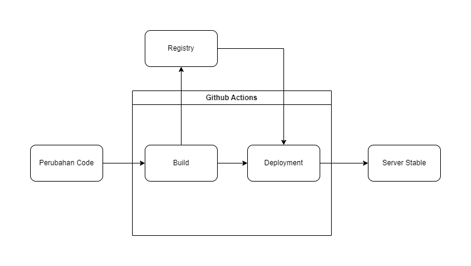

## Implementasi

Pada Implementasi ini akan mempraktekkan point-point yang sudah dijelaskan pada bagian sebelumnya. Dimana kita akan membuat sebuah project pada github terhubung dengan pipeline CI/CD menggunakan Github Actions sehingga ketika ada perubahan pada repository, maka akan otomatis melakukan build ke registry dan deploy ke server.

Untuk alur pipeline CI/CD yang akan diimplementasikan adalah sebagai berikut:

Pada implementasi ini kita menggunakan 1 server saja untuk tempat deploy dan untuk ci/cd kita menggunakan github actions.

Langkah-langkah yang akan dilakukan adalah sebagai berikut:

1. Membuat repository pada github

untuk project kali ini akan menggunakan repository yang sudah ada sebelumnya yaitu [dapat diakses disini](https://github.com/fhinnn/web-coba)

2. Setup Server

menginstall beberapa package yang nantinya diperlukan yaitu: docker, git, dan ssh. 

membuat shell script untuk auto pull dan auto build docker image pada server dan juga beberapa keperluan lain seperti Dockerfile dan nginx.conf. 

3. koneksi dengan Github Actions

membuat file `.github/workflows/ci-cd.yml` pada repository yang sudah dibuat sebelumnya. 

4. Masukkan Secret variabel pada repository github pada menu `Settings` -> `Secrets` -> `New repository secret`

5. Push perubahan pada repository dan testing sampai proses CI/CD selesai.